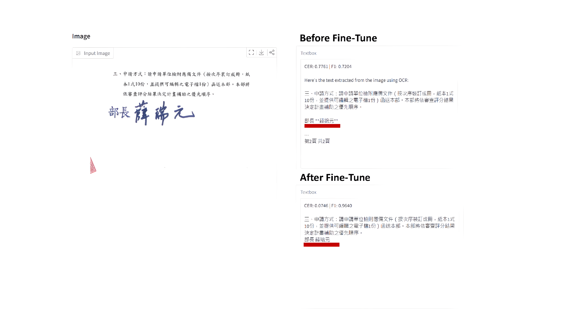

# Gemma-OCR

This project focuses on fine-tuning vision-language models for OCR, aiming to support various document elements (text, tables, seals, etc.) and deliver strong Chinese text recognition.


## Results

* train/val data: 423/48
* test data 2358

| Models | F1-score | CER |
| --- | --- | --- |
| gemma3-12b | 0.559 | 0.904 |
| gemma3-12b-sft | 0.788 | 0.537 |
| gemma3-12b-hps | 0.864 | 0.388 |
| DotsOCR | 0.805 | 0.394 |
| PaddleOCR | 0.851 | 0.354 |

Notes: gemma3-12b: no fine-tuning; gemma3-12b-sft: SFT; gemma3-12b-hps: SFT + hyperparameter search.

## Metadata Examples

### 專有名詞 (Terminology)


### 表格 (Tables)

## Project Structure

```
core/
├── sft_gemma.py                    # Main training script
├── gemma_hyperparameter_search.py  # Automated hyperparameter optimization (Optuna)
├── evaluate.py                     # Main evaluation script for OCR models
├── count_score.py                  # Score calculation with text normalization
├── gemma_adapter_merge.py          # Merge LoRA adapters to base model
├── split_dataset.py                 # Split raw data to train/val/test set
└── data_analysis/                  # Analysis and visualization tools

configs/hyperparm_configs/
├── default.json                    # Default training configuration
├── base_config.json                # Base config for hyperparameter search
├── search_space_aggressive.json    # Aggressive search space
├── search_space_conservative.json  # Conservative search space
└── grid_search_small.json          # Small grid search configuration

lib/
└── utils/
    └── count_metric.py             # Metric calculation utilities (F1, CER)

ui/
└── compare_finetune.py             # Gradio UI for comparing two models
└── evaluate_viewer.py              # frontend for model's OCR results
└── prompt_manager.py               # frontend for manage VLM prompt
```

## Usage

### 0. Requirements

```bash
pip install -r requirements.txt
```

### 1. Prepare Data

**Data Format:**

Please prepare a JSON file along with a directory containing the corresponding images.
Each JSON file should follow the structure below:

```json
[
  {
    "img_path": "path/to/image.png",
    "ocr_results": "text content"
  }
]
```

See [data/example.json](data/example.json) for a concrete example.

**Split Dataset:**

Split your prepared dataset into train/val sets:

```bash
python core/split_dataset.py \
  --input data/raw_data/ocr.json \
  --output_dir data/input
```

**Optional - Data Analysis:**

Analyze the train/test data distribution:

```bash
python core/data_analysis/analyze_train_test_data.py
```

### 2. Fine-tune

#### Option A: Direct Training with Fixed Parameters

```bash
# Basic training
python core/sft_gemma.py \
  --model_name /tmp2/share_data/google--gemma-3-12b-it \
  --config configs/hyperparm_configs/default.json

# Custom parameters
python core/sft_gemma.py \
  --model_name /tmp2/share_data/google--gemma-3-12b-it \
  --input_data data/input/ocr_non_test.json \
  --output_dir models/gemma-ocr-custom \
  --learning_rate 2e-4 \
  --num_train_epochs 5 \
  --gradient_accumulation_steps 4 \
  --per_device_train_batch_size 1 \
  --max_seq_length 8192
```

**Key Arguments:**

| Argument | Type | Default | Description |
|----------|------|---------|-------------|
| `--config` | str | configs/hyperparm_configs/default.json | Path to config JSON file |
| `--model_name` | str | /tmp2/share_data/google--gemma-3-12b-it | Path to pretrained VLM checkpoint |
| `--input_data` | str | data/input/ocr_non_test.json | Path to training data JSON file |
| `--instruction` | str | 請給我 OCR 結果 | Instruction text for OCR task |
| `--output_dir` | str | models/test_input_size=500 | Output directory for training artifacts |
| `--load_in_4bit` | bool | True | Enable 4-bit quantization to reduce memory |

**Note:** Command-line arguments override config file values.

#### Option B: Hyperparameter Search (Recommended)

Find the best hyperparameters automatically using Optuna:

```bash
# Quick start - Bayesian optimization with 20 trials (recommended)
python core/gemma_hyperparameter_search.py \
  --study-name gemma-ocr-opt \
  --n-trials 20 \
  --config configs/hyperparm_configs/optuna/default.json

# Custom configuration with all options
python core/gemma_hyperparameter_search.py \
  --study-name my-ocr-search \
  --search-mode bayesian \
  --n-trials 20 \
  --config configs/hyperparm_configs/optuna/config.json \
  --model-name /tmp2/share_data/google--gemma-3-12b-it \
  --input-data data/input/ocr_non_test_data=500.json \
  --base-output-dir models/hyperparam_search
```

**Analyze hyperparameter search results:**

```bash
# Launch interactive Optuna Dashboard, open browser at http://127.0.0.1:8080
optuna-dashboard sqlite:///optuna_studies/gemma-ocr-run.db
```

### 3. Merge LoRA Adapters

```bash
# Merge LoRA adapters to base model (required for VLLM)
python core/gemma_adapter_merge.py

# (Optional) test merge correct (remember to change the input_dir)
python tests/test_merge.py
```

### 4. Evaluate

Run OCR evaluation using VLLM service:

```bash
# Open VLLM service and change to finetune VLM path
docker compose -f configs/docker-compose-gemma12b-merge.yml up -d
```

```bash
# Basic evaluation with default settings
python core/evaluate.py

# Evaluate with custom VLLM URL and test-data
python core/evaluate.py \
  --vllm-url http://192.168.1.78:3472/v1/chat/completions \
  --data-file data/input/ocr_test.json \
  --top-k 100 \
  --model-name mistralai3 \
  --output-file results/mistral_evaluation_results.json \
  --prompt-config configs/ocr_prompt/default.yml \
  --workers 4 \
  --save-interval 50
```

**Arguments:**

| Argument | Type | Default | Description |
|----------|------|---------|-------------|
| `--vllm-url` | str | http://192.168.1.76:3132/v1/chat/completions | VLLM service URL endpoint |
| `--data-file` | str | data/benchmark/ocr_test.json | Path to test data JSON file |
| `--top-k` | int/None | None | Number of samples to evaluate (None = all samples) |
| `--model-name` | str | mistralai3 | Model identifier name |
| `--output-file` | str | results/mistral_evaluation_results.json | Path to save evaluation results |
| `--workers` | int | 2 | Number of parallel workers for concurrent processing |
| `--save-interval` | int | 0 | Save checkpoint every N samples (0 = disabled) |
| `--checkpoint-file` | str | None | Custom checkpoint file path (auto-generated if None) |
| `--mode` | str | vllm | API call mode: `vllm`, `vllm_stream`, or `local_api` |
| `--prompt-config` | str | configs/ocr_prompt/default.yml | Path to YAML config file for OCR prompt |

**API Modes:**
- `vllm`: Standard VLLM API call (recommended for most cases)
- `vllm_stream`: Streaming response mode with real-time output
- `local_api`: Call local OCR API service (different endpoint format)

(Optional) If new score metrics need to be added, this script can be updated to compute the new metrics.
```bash
# Recalculate with normalized text
python core/count_score.py \
  --input results/mistral_evaluation_results.json \
  --output results/mistral_evaluation_results_norm.json
```

(Optional) Evaluaton Result Analysis
```bash
python core/add_layout.py \
  --source-dir source_dir

python core/data_analysis/eval_result_analysis.py \
  --result_path result_path
```

### 5. View and Compare Results with UI

#### View Single Model Results

Launch a Gradio interface to browse evaluation results for a single model:

```bash
# View results from default directory
python ui/evaluate_viewer.py

# View results from custom directory
python ui/evaluate_viewer.py \
  --eval_dir results/evaluation/test_data=2400 \
  --server_port 7860
```

#### Compare Two Models

Launch a Gradio interface to visually compare two model evaluation results:

```bash
# Compare any two models
python ui/compare_finetune.py \
  --model1 results/evaluation/model-A.json \
  --model2 results/evaluation/model-B.json
```

## Core Module Documentation

For detailed documentation on all core scripts including hyperparameter search, training, evaluation, and analysis tools, see [core/README.md](core/README.md).

**Quick Links:**
- [Training Scripts](core/README.md#training-scripts) - `sft_gemma.py`
- [Hyperparameter Search](core/README.md#hyperparameter-search) - `gemma_hyperparameter_search.py`
- [Evaluation Scripts](core/README.md#evaluation-scripts) - `evaluate.py`, `count_score.py`
- [Model Management](core/README.md#model-management) - `gemma_adapter_merge.py`
- [Data Processing](core/README.md#data-processing) - `split_dataset.py`
- [Best Practices](core/README.md#best-practices) - Tips for training, search, and deployment

## Evaluation Metrics

- **CER (Character Error Rate)**: Measures character-level accuracy
- **F1 Score**: Character-level F1 score for OCR quality

## Output Format

Evaluation results are saved as JSON with the following structure:

```json
{
  "overall_cer": 0.0234,
  "overall_f1": 0.9876,
  "total_samples": 100,
  "timestamp": "2025-12-16T10:30:00",
  "model_name": "mistralai3",
  "samples": [
    {
      "image_path": "path/to/image.png",
      "label": "ground truth text",
      "prediction": "predicted text",
      "cer_score": 0.0123,
      "f1_score": 0.9890
    }
  ]
}
```
